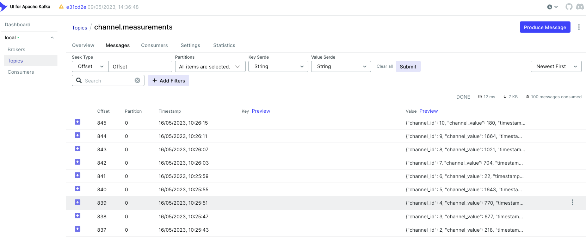
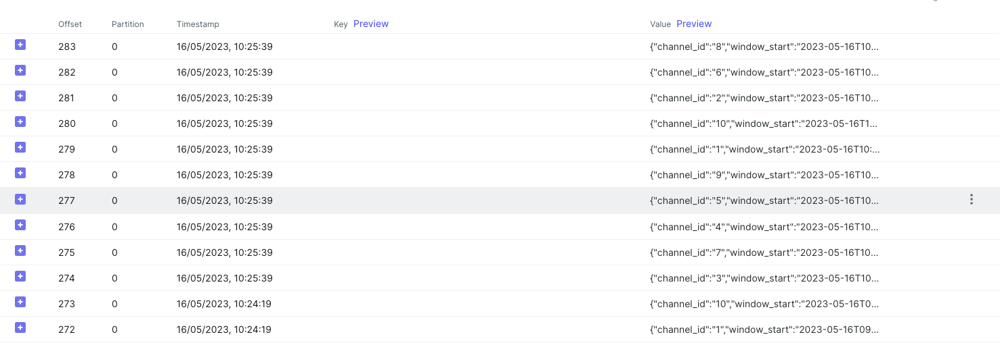

# APP details

This proof of concept (POC) application showcases how Kafka measurements can be processed in Flink to calculate the average, maximum, minimum, standard deviation, and total readings using a 5-minute tumbling window. The application provides an example of how Kafka and Flink can be integrated to perform real-time data processing tasks.


Development Environment
To set up your development environment:

## Create a virtual environment: 
`mkvirtualenv -p /usr/local/bin/python3.8 flink-poc`

* Install dependencies: 
  * pip install -r requirements.txt


## Running the Application
  You can use the provided docker-compose.yml file to install and run Kafka, Flink, and ZooKeeper containers. To start the containers, navigate to the compose directory and run the following command:

```docker-compose up -d```


## Producer details:
The application utilizes the Faker library to create artificial channel measurements for roughly 10 sensors, with a delay of 15 seconds before posting them to a Kafka broker via the Confluent Kafka Python client library. The messages generated by the application are serialized into JSON format before being sent to the broker. Additionally, the application incorporates a callback function to manage message production outcomes and a logger object to log produced messages in a file
## Running the Producer

To run the producer code, navigate to the producer directory and run the following command:

````
cd producer
python channel_producer.py
````

## Submitting the Flink Job
To submit the Flink job, edit the flink_job.py file and replace the following line with the path to the necessary JAR files which are present in compose folder:


````
table_env.get_config().get_configuration().set_string("pipeline.classpaths", "file:///Users/symphonyai/Documents/work/flink-tutorial/flink_poc/compose/jars/flink-sql-connector-kafka-1.17.0.jar;
                                                                              file:///Users/symphonyai/Documents/work/flink-tutorial/flink_poc/compose/jars/flink-shaded-force-shading-16.1.jar")
````

Then, run the following command:

```
cd flink_processor
python flink_job.py
```

This will submit the Flink job to the Flink cluster running in the Docker container.


The topic names shown in the screenshots contain messages from the producer and results from Flink. For instance, the producer topic is named "channel.measurements" while the Flink sink topic is named "sink.measurement_reports"


# Producer messages in kafka


# Sink messages in kafka



